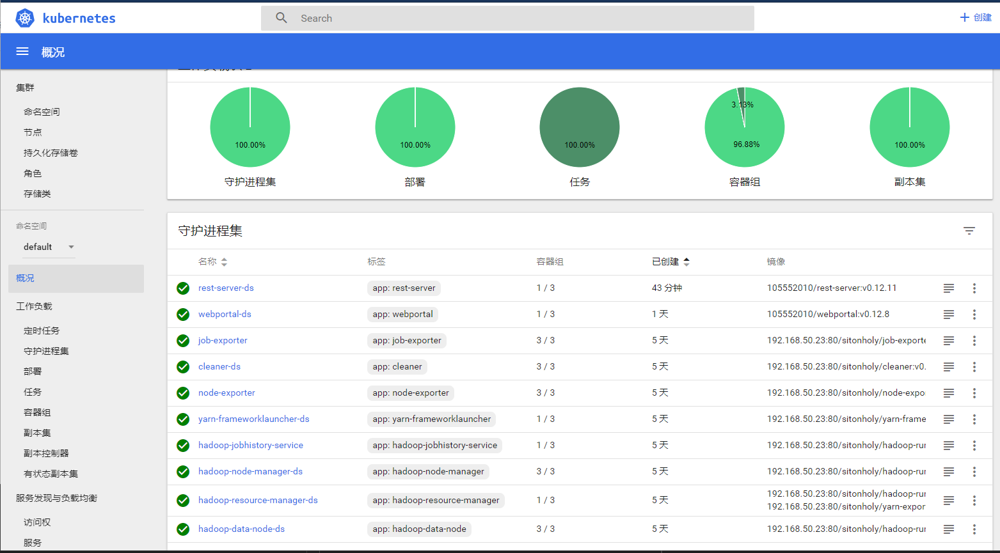
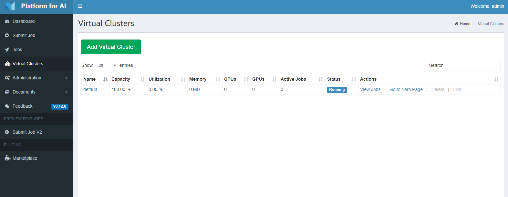

# 1. OpenPai 安装文档

原链接为 [distributed-deploy](https://github.com/microsoft/pai/blob/v0.14.0/docs/pai-management/doc/distributed-deploy.md)

<!-- TOC -->

- [1. OpenPai 安装文档](#1-openpai-安装文档)
        - [1.0.1. 选择合适版本的Dev-box](#101-选择合适版本的dev-box)
        - [1.0.2. 运行Dev-box](#102-运行dev-box)
        - [1.0.3. 在dev-box中进入工作区](#103-在dev-box中进入工作区)
        - [1.0.4. 修改yaml文件](#104-修改yaml文件)
        - [1.0.5. 生成配置文件](#105-生成配置文件)
        - [1.0.6. 修改配置文件](#106-修改配置文件)
        - [1.0.7. 部署k8s](#107-部署k8s)
        - [1.0.8. 检查k8s部署状态](#108-检查k8s部署状态)
        - [1.0.9. 上传openpai配置到k8s集群](#109-上传openpai配置到k8s集群)
        - [1.0.10. 部署pai集群](#1010-部署pai集群)
        - [1.0.11. 查看集群](#1011-查看集群)

<!-- /TOC -->


### 1.0.1. 选择合适版本的Dev-box

```
sudo docker pull docker.io/openpai/dev-box:v0.14.0
```

### 1.0.2. 运行Dev-box

```bash
sudo docker run -itd --name=dev-box openpai/dev-box:v0.14.0 bash
```

### 1.0.3. 在dev-box中进入工作区

```bash
sudo docker exec -it dev-box /bin/bash
cd /pai
```

### 1.0.4. 修改yaml文件
`/pai/deployment/quick-start/quick-start-example.yaml`

```YAML
# quick-start.yaml

# (Required) Please fill in the IP address of the server you would like to deploy OpenPAI
machines:
  - 192.168.1.11
  - 192.168.1.12
  - 192.168.1.13

# (Required) Log-in info of all machines. System administrator should guarantee
# that the username/password pair or username/key-filename is valid and has sudo privilege.
ssh-username: siton 
ssh-password: siton

# (Optional, default=None) the key file that ssh client uses, that has higher priority then password.
#ssh-keyfile-path: <keyfile-path>

# (Optional, default=22) Port number of ssh service on each machine.
#ssh-port: 22

# (Optional, default=DNS of the first machine) Cluster DNS.
#dns: <ip-of-dns>

# (Optional, default=10.254.0.0/16) IP range used by Kubernetes. Note that
# this IP range should NOT conflict with the current network.
#service-cluster-ip-range: <ip-range-for-k8s>
```
### 1.0.5. 生成配置文件

```bash
python paictl.py config generate -i /pai/deployment/quick-start/quick-start-example.yaml -o ~/pai-config -f
```

### 1.0.6. 修改配置文件
生成的文件在/root/pai-config中

1. `layout.yaml`

```YAML
machine-sku:
  k80-node:
    mem: 40G                    #内存
    gpu:
      type: Tesla K80           #GPU类型
      count: 4                  #GPU个数
    cpu:
      vcore: 24                 #线程数
    os: ubuntu16.04             #系统类型（1804可能也行）
  p100-node:
    mem: 20G
    gpu:
      type: Tesla P100
      count: 2
    cpu:
      vcore: 24
    os: ubuntu16.04

machine-list:
  - hostname: Sitonholy         #主机名
    hostip: 192.168.199.10      #IP地址
    machine-type: k80-node      #显卡类型对应上面
  - hostname: xxx
    hostip: yyy
    machine-type: p100-node
```

2. `services-configuration.yaml`

```YAML
    tag: v0.13.0                #修改pai版本
drivers:
#  set-nvidia-runtime: false
#  # You can set drivers version here. If this value is miss, default value will be 384.111
#  # Current supported version list
#  # 384.111
#  # 390.25
#  # 410.73
#  # 418.56
  version: "410.73"             #修改驱动版本

```

3. `kubernetes-configuration.yaml`

```
  load-balance-ip: 192.168.31.211  #写主节点或负载IP

  docker-registry: docker.io/mirrorgooglecontainers  #国内可以下载的镜像
```

### 1.0.7. 部署k8s

```bash
cd /pai
./paictl.py cluster k8s-bootup -p ~/pai-config
```

### 1.0.8. 检查k8s部署状态

运行以下命令检查k8s状态

```bash
kubectl get node
kubectl get pod
```


### 1.0.9. 上传openpai配置到k8s集群

```bash
./paictl.py config push -p ~/pai-config
```

### 1.0.10. 部署pai集群

确认好集群在When Kubernetes is up and running

```
./paictl.py service start
```

### 1.0.11. 查看集群

登录浏览器 http://masterip

